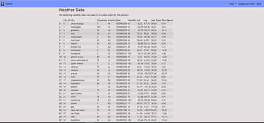

# Web_Design - Web Visualization Dashboard

A website dashboard is created in order to showcase [python_api](https://github.com/gamem001/python_api.git) the python_api analysis.

The website consists of 7 pages total, including:

* A [landing page](#landing-page) containing:
  * An explanation of the project.
  * Links to each visualization page along with a sidebar containing preview images of each plot that can be selected for a larger image.
* Four [visualization pages](#visualization-pages), each with:
  * A descriptive title and heading tag.
  * The plot/visualization itself for the selected comparison.
  * A paragraph describing the plot and its significance.
* A ["Comparisons" page](#comparisons-page) that:
  * Contains all of the visualizations on the same page allowing for visual comparison.
* A ["Data" page](#data-page) that:
  * Displays a bootstrap responsive table containing the data used in the visualizations.

At the top of each page, the navigation menu :

* Has the name of the site which allows users to return to the landing page from any page.
* Contains a dropdown menu named "Plots" that provides a link to each individual visualization page.
* Provides two more text links: "Comparisons," which links to the comparisons page, and "Data," which links to the data page.
* Finally, the website is responsive (using media queries).

### Screenshots

This section contains screenshots of each page built and referenced above, some at varying screen widths.

#### Landing page

Large screen landing page:

Small screen landing page:

#### Comparisons page

Large screen comparison page:

#### Data page

Large screen data page:

#### Visualization pages

Large screen visualization page:

#### Navigation menu

Large screen navigation menu:

